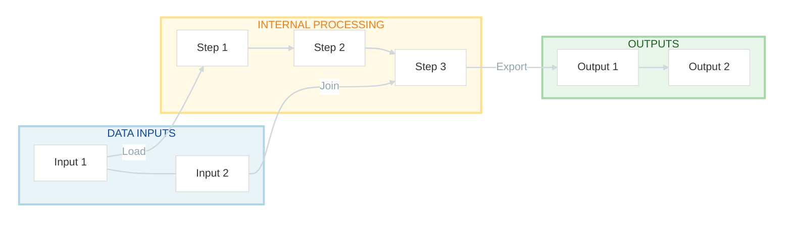

# Skill: Mermaid Pipeline Diagram Style (AirBnB_NLP4socialscience)

## Goal
Generate consistent Mermaid pipeline diagrams for notebooks/scripts with a clean white background and pastel blocks.

## When to use
- Any new pipeline notebook/script section intro
- Any request to add a workflow/flowchart diagram
- Any update to existing Mermaid diagrams for readability

## Required Layout Rules
1. Use `flowchart LR` for the global layout.
2. Build exactly 3 main blocks (subgraphs):
   - `DATA INPUTS` (blue group)
   - `INTERNAL PROCESSING` (yellow group)
   - `OUTPUTS` (green group)
3. Main blocks should be arranged horizontally (left to right).
4. Nodes inside each block should be arranged vertically (`direction TB`).

## Required Visual Style
- Background must stay white.
- Use pastel fills and soft borders.
- Use light arrows.
- Keep labels short and action-oriented.

### Base Mermaid init to reuse
```mermaid
%%{init: {'theme': 'base', 'flowchart': { 'nodeSpacing': 18, 'rankSpacing': 20, 'diagramPadding': 6 }, 'themeVariables': { 'primaryColor': '#ffffff', 'primaryBorderColor': '#d9d9d9', 'background': '#ffffff', 'mainBkg': '#ffffff', 'clusterBkg': '#ffffff', 'lineColor': '#cfd8dc', 'edgeLabelBackground':'#ffffff'}} }%%
```

### Group colors
- Input group: `fill:#E8F4F8, stroke:#B0D4E3`
- Process group: `fill:#FFF9E6, stroke:#FFE082`
- Output group: `fill:#E8F5E9, stroke:#A5D6A7`

### Arrow style
```mermaid
linkStyle default stroke:#cfd8dc,stroke-width:2px,color:#90a4ae
```

## Recommended Node Text Pattern
- Verb + object, max 2 lines where possible
- Examples:
  - `Load Reviews`
  - `Filter Last Year`
  - `Clean Comments`
  - `Export CSV`

## Reusable Template

